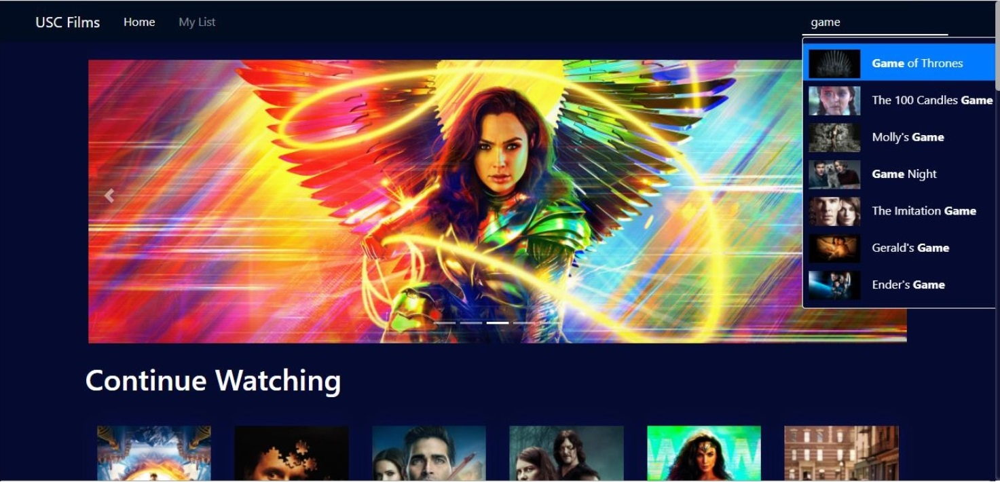
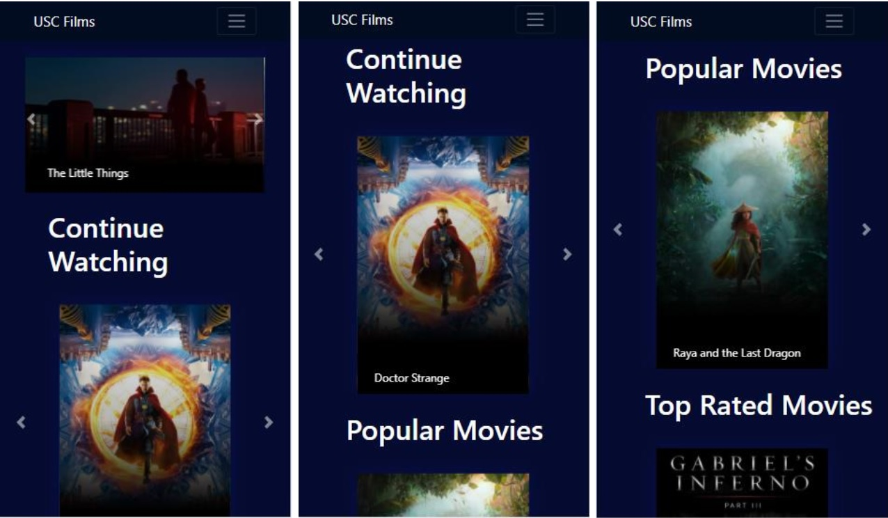

# Description
This repository was made for studying and practising purpose. It implements several versions of app that displays movies information from TMDB services.
 
 

# Projects
- Backend: Implemented with NodeJS and ExpressJS
- Frontend
  -  Web-version: Implemented with Angular 10
  -  Mobile-version: Implemented with Android in Java

# Screens
## 1. Web frontend
### 1.1. Homepage screen
  
<b>Figure 1.1.1</b>: Homepage overview

  
   
   
  
<b>Figure 1.1.2</b>: Homepage sections. (<i>Top Left</i>) Continue watching items. (<i>Top Right</i>) Popular movies. (<i>Bottom Left</i>) Top-rated movies. (<i>Bottom Right</i>) Trending movies.
  
  <table>
    <tr align="center">
      <td></td>
      <td></td>
    </tr>
    <tr align="center">
      <td></td>
      <td></td>
    </tr>
  </table>
  
  
 ### 1.2. Detail page screen
  
<b>Figure 1.2.1</b>: Detail page

  
  
<b>Figure 1.2.2</b>: Detail page, Add to watchlist and Remove from watchlist

  <table>
    <tr align="center">
      <td></td>
      <td></td>
    </tr>
  </table>
  
<b>Figure 1.2.3</b>: Detail page sections. (<i>Top Left</i>) Share buttons and Casts section. (<i>Top Right</i>) Cast detail popup. (<i>Bottom Left</i>)Reviews section. (<i>Bottom Right</i>) Recommended movies and Similar movies sections

  <table>
    <tr align="center">
      <td></td>
      <td></td>
    </tr>
    <tr align="center">
      <td></td>
      <td></td>
    </tr>
  </table>

### 1.3. Watchlist screen
  
<b>Figure 1.3.1</b>: Watchlist page

  
  
<b>Figure 1.3.2</b>: Empty watchlist

  
 

  
  
### 1.4. Responsive Design
 
<b>Figure 1.4.1</b>: RWD sample screens

 <table>
    <tr align="center">
      <td width='50%'></td>
      <td></td>
    </tr>
   <tr align="center">
      <td width='50%'></td>
      <td></td>
    </tr>
    <tr align="center">
      <td colspan='2' align='center'></td>            
    </tr>
  </table>
  
  
## 2. Mobile  frontend
### 2.1. App icon, splash screen and loading screen.
  
<b>Figure 2.1</b>: (<i>Left</i>) App icon. (<i>Center</i>) Splash screen. (<i>Rihgt</i>) Loading screen.
  
  <table>
    <tr align="center">
      <td></td>
      <td></td>
      <td></td>
    </tr>   
  </table>
   
  
  
### 2.2. Home screen
  
<b>Figure 2.2</b>: Home screen. (<i>Left</i>) Movies tab . (<i>Center</i>) TV Shows tab. (<i>Rihgt</i>) Movie-item Popup.
  
  <table>
    <tr align="center">
      <td></td>
      <td></td>
      <td></td>
    </tr>   
  </table>
   
  
  
### 2.3. Search screen
  
<b>Figure 2.3</b>: Search screen. (<i>Left</i>) Empty search. (<i>Center</i>) Search results. (<i>Rihgt</i>) No result found.
  
  <table>
    <tr align="center">
      <td></td>
      <td></td>
      <td></td>
    </tr>   
  </table>
   
  
  
### 2.4. Watchlist screen
  
<b>Figure 2.4</b>: Watchlist screen. (<i>Left</i>) Empty watchlist. (<i>Center</i>) Watchlist with items. (<i>Rihgt</i>) Drag & Drop items.
  
  <table>
    <tr align="center">
      <td></td>
      <td></td>
      <td></td>
    </tr>   
  </table>

### 2.5. Detail screen
   
  
<b>Figure 2.5</b>: Movie Detail screen.
  
  <table>
    <tr align="center">
      <td></td>
      <td></td>
      <td></td>
    </tr>   
  </table>
  
<b>Figure 2.6</b>: Review screen.
  
  

      
  
   
   

# Acknowledgement
  - A great appreciation for **USC CSCI571 Spring 2021 TA & Grader team** for their requirements and instructions.
  - The apps are developed using references to the TMDB services
